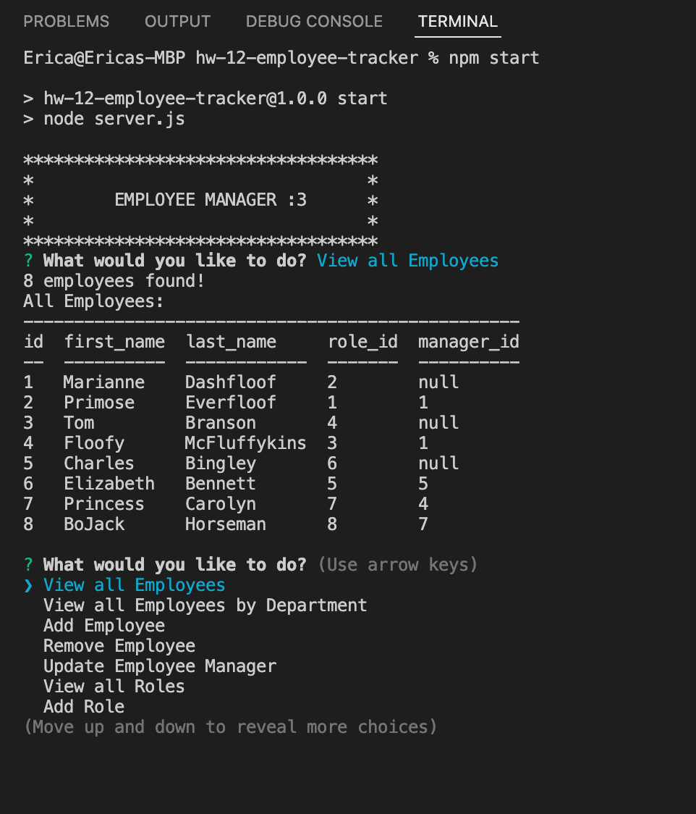

# Employee Tracker

## Table of Contents

- [Mock-up](#mock-up)
- [Description](#description)
- [Usage](#usage)
- [User-Story](#user-story)
- [Installation](#installation)
- [Credit](#credit)

## Mock-up

The following a video file of what is expected of the application: <br/>
[Deployed Application Video](https://drive.google.com/drive/folders/1wiHPWul6dmxzbCo-9KXMFy-27YMrm66g?usp=sharing)


## Description

This application is meant to be used in the terminal/command line.  It allows the user to have all their employees on file and be able to add, remove, and edit the list as needed. 

## Usage

This particular project was the 10th homework assignment in my Georgia Tech coding bootcamp, to build a command-line application from scratch to manage a company's employee database, and to exercise understanding of the following:

- MySQL, and node applications such as: inquirer, and console table
- creating a CMS
- creating databases

## User-Story

```
AS A business owner
I WANT to be able to view and manage the departments, roles, and employees in my company
SO THAT I can organize and plan my business
GIVEN a command-line application that accepts user input
WHEN I start the application
THEN I am presented with the following options: view all departments, view all roles, view all employees, add a department, add a role, add an employee, and update an employee role
WHEN I choose to view all departments
THEN I am presented with a formatted table showing department names and department ids
WHEN I choose to view all roles
THEN I am presented with the job title, role id, the department that role belongs to, and the salary for that role
WHEN I choose to view all employees
THEN I am presented with a formatted table showing employee data, including employee ids, first names, last names, job titles, departments, salaries, and managers that the employees report to
WHEN I choose to add a department
THEN I am prompted to enter the name of the department and that department is added to the database
WHEN I choose to add a role
THEN I am prompted to enter the name, salary, and department for the role and that role is added to the database
WHEN I choose to add an employee
THEN I am prompted to enter the employee’s first name, last name, role, and manager, and that employee is added to the database
WHEN I choose to update an employee role
THEN I am prompted to select an employee to update and their new role and this information is updated in the database 
```

## Installation
The user should clone the repository from GitHub. This application requires Node.js, Inquirer, console.table and mysql2. To start application run npm start. To view database from MySQL run mysql -u root -p.


## Credit
Myself, Erica Breig